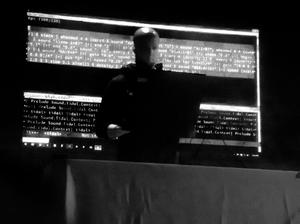
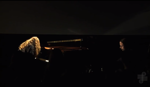
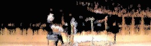
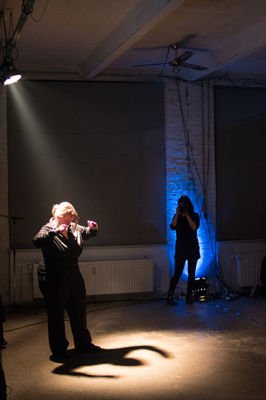
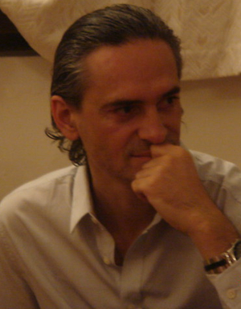
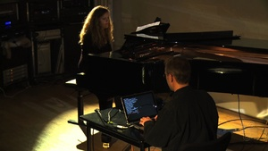
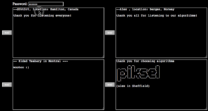
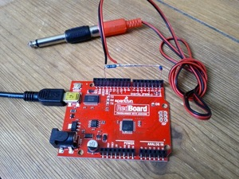
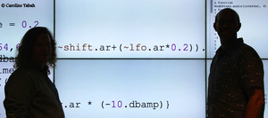
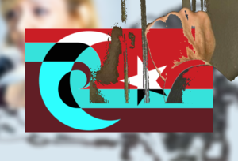

## humanly-organized sound - [Kindohm](http://www.kindohm.com) (Wednesday, Club B)

In this performance I will use Tidal to create algorithmic and broken electronic music, influenced by and fusing classic styles such as Drum & Bass, breakcore, glitch, dub, and minimal industrial. I will use Tidal to control MIDI synthesizers as well as to create patterns from original samples. The performance will demonstrate a balance between pure improvisation and composed, recognizable, repeatable motifs.

<em>
Mike Hodnick (a.k.a. Kindohm) is an independent programmer and sound artist from Minneapolis, USA. In 2014 he produced the 365TidalPatterns project, regularly performed live-coded music sets, released "I Am a Computer" on Xylem records - an album produced exclusively with Tidal, and received the Minnesota Emerging Composer Award from the American Composer's Forum. Mike continues to perform regularly and produce music with code.
</em> 
## HTB2.0 - [Kate Sicchio](http://blog.sicchio.com) (Tuesday, Concert D)

This dance piece is an exploration of live coded electronics and improvisational movement. A dancer wears a custom garment of haptic actuators. These actuators are programmed real-time via OSC to 'buzz' on the right and left sides of the dancer to indicate which side of the body the dancer will move. The score is being live coded by choreographer while the dancer is responding to the haptic feedback. This piece explores live coding of bodies and movement as output rather than a sonic or visual output as found in many live coding performances.

<em>
Dr. Kate Sicchio is a choreographer, media artist and performer whose work explores the interface between choreography and technology. Her work includes performances, installations, web and video projects and has been shown in Philadelphia, New York City, Canada, Germany, Australia, Belgium, and the UK at venues such as Banff New Media Institute (Canada), WAX Brooklyn (New York), FoAM (Brussels) and Arnolfini Arts Centre (UK).

</em> 
## Cult of graa> - Niklas Reppel (Wednesday, Concert F)

Cult of graa>' is an umbrella term for instant composing performances, coded live and from scratch with the aid of the 'graa>' mini-language.  

The 'graa>' language is a self-developed, Python-based domain specific language for the rapid creation and manipulation of directed graphs, Markov chains and other stochastic processes. Thus, it incorporates non-deterministic elements in its very foundations, and the challenge for the performer lies in juggling with a bunch of musical objects, each of which behaves unpredictable to a certain amount, without drifting into complete randomness.

While the language lends itself for a variety of musical styles, this particular performance will explore the juxtapositon of piano sounds and simple synthesized waveforms and is inspired by the somewhat harsh piano works of Giacinto Scelsi, the player-piano pieces by Nancarrow, but also the pattern-oriented minimalism of composers like Terry Riley.

<em>
Niklas Reppel (http://www.parkellipsen.de), born on November 21, 1983 in Witten an der Ruhr, Germany, is a programmer and musician and holds a B.Sc. in computer science from TU Dortmund. 
He recently left the world of commerical software development to pursue a master's degree in music informatics at the IMWI at HfM Karlsruhe. 
Formerly rooted in the local improv- and jam-session scene as an instrumentalist, an interest for improvisative live-coding developed quite naturally. Bored by deterministic music, and inspired by the industrial/natural soundscapes of his home area, non-determinism gained increasing significance in his work. 
</em> 
## Tlaxcaltech - ~ON [Emilio Ocelotl + Luis Navarro] (Wednesday, Club B)

![~ON [Emilio Ocelotl + Luis Navarro]](images/performances/thumb.13.jpeg)Tlaxcaltech is an exploration of dance music and controlled improvisation through the use of SuperCollider from a mexican perspective.

<em>
~ ON 

Duo formed in 2012 by Luis Navarro and Emilio Ocelotl. It focuses on audiovisual creation from programming languages ​​and human-machine interaction, mainly using Fluxus and SuperCollider. 

~ ON has performed at various events such as the International Symposium of Music and Code /*Vivo*/ (Mexico, 2012), the audiovisual concerts series Source (Mexico , 2013) , La Escucha Errante: research meetings , and electroacoustic sound creation (Bilbao, Spain 2014), Databit Festival (Arles, France, 2014 ) and at the  Bern (Bern, Switzerland, 2014 ).
In 2015 ~ ON organized the Permanent Seminar of the Algorithmic Party "Reggaetron".

Emilio Ocelotl: Sociologist and violist. He has taken courses in the area of computer music and composition at the Multimedia Center of the National Arts Center and the Mexican Center for Music and Sonic Arts. In 2013 he awarded a scholarship to support Young Composers in the Area of the Mexican Center for Electroacoustic Music and Sonic Arts. His work has been presented at the Museum of Contemporary Art UNAM under the International Symposium on Music and Code / * vivo* / in the Multimedia Center of the National Arts Centre; his pieces has been presented at the International Cervantes Festival (2013) in the framework of the International Forum of New Music "Manuel Enriquez" (2014). https://soundcloud.com/emilio-oc

Luis Navarro: he studied music composition and Performance in contemporary popular music at the Academy of Music Fermatta in Mexico City (2005-2011).  In 2012 he collaborated in the creation of the International Symposium of Music and Code 
/*VIVO*/ and lectured on the subject of "live programming" in places like the Campus Party Mexico (2011). His work, that includes image and sound, has been presented at the Multimedia Media Centre of the National Centre of Arts and at the universities UAM (2013), UNAM (2011) and University of Chapingo (2010). https://sites.google.com/site/luisnavarrodelangel

</em> 
## Unorganised Music - [Calum Gunn](http://www.calumgunn.com) (Wednesday, Club B)

Unorganised Music is a monolithic moiré pattern of rave-inflected, ever-shifting drums, stabs and sirens. A paranoid journey into the dark corners of the dancefloor.

Using a custom-built SuperCollider patch, two streams of sound are used to curate unnatural patterns on the fly, jumping between bass-heavy rhythms and hoover tunnels at will.

<em>
Calum Gunn is a Scottish programmer and musician living in London.
</em> 
## Linalab - [Linalab](http://linalab.com) (Wednesday, Club B)

live coding – live patching

The laptop won’t produce sound by itself, it will be sending control signals to analogic modular synthesizer

<em>
Lina Bautista, musician and sound artist, she was born in Bogotá, Colombia. She is currently living and working in Barcelona, Spain.
 Her work is divided in two different ways: music and live performances and soundscapes, exhibitions and other sound projects. As a musician she has participated in: Sirga Festival, Cau d’Orella, TEI international congress, Live.Coding.Festival, LEM, Eufònic and Sonar. 
She currently works with The Orquesta del caos, research project about sound art and experimental music, and host of the Zeppelin Festival. She is member of Sons de Barcelona, a collaborative group that work in fostering the interest in sound and technologies, and she also makes DIY workshops with Familiar.

</em> 
## Warp Hole Sounds - [Warp Hole Sounds, AV Torres](http://www.andresvillatorres.com/?p=542) (Monday, Club A)

“Warp Hole Sounds” is an algorithmic exploration and an audio visual experience of the non-trivial phenomena, which in theory is possible inside these unseen and unexperienced corners of our universe. It pursuits a more embodied understanding of the behaviour of the physics inside or close to these bizarre spaces.

Through computer algorithms, Andres simulates strong gravitational fields which evolve in time by being nourished by particles (light, matter, energy and sound). The illusive infinite freedom from algorithms allow to simulate and to tweak several conditions from these theoretical places, provoking behaviours that some times cannot be computed or previously estimated. A series of sonic and visual experiences arise from the never ending evolution of these simulated wormholes.

<em>
Born in Mexico City in 1985. Andres Villa Torres has a Design background and a long relationship with Music. He likes to explore the borders between the digital, the material and the "real" serving himself from diverse interactive and non-interactive media, technology and algorithms. 
</em> 
## Improvisation for Pianist (Disklavier) and Live Coder - Juan A. Romero & Anne Veinberg (Monday, Concert A)

The improvisation consists of mutual feedback using the Disklavier as an acoustic and mechanical interface between the pianist and the live coder. Phrases and notes will be recorded and algortihmically transformed and played back throught the same device interfering and interacting with the player. Some sound synthesis will be also live coded to expand and adapt the sound of the piano and the playing style of the perfomer.

<em>
Juan A. Romero was born 1982 in Medellín, Colombia. He is member of the live coding band Benoît and the Mandelbrots and the audiovisual performance duo Ganzfeld. At the moment he is a doctoral candidate and research assistant at the IMWI (HfM Karlsruhe).
</em> 
## End of buffer - [Repl Electric](http://www.repl-electric.com) (Tuesday, Concert D)

My performance is a mix of improvisation and composed music and visuals. The primary programming language used is Clojure a LISP based language running on the JVM. The visuals are written with the OpenGL Shading Language and the music with Overtone a client to the SuperCollider sound engine and finally a library I created myself called MUD optimizing immediacy of expression. All of this is bound together using the Emacs editor, taking a common tool used widely for programming and emphasizing its power and feedback in coding live.

There is a deep connection between sound and visuals, experimenting with different ways of visualizing frequencies, beats and time. My visual style is focused on simple 2d geometric shapes, playing with peoples assumption around the solidity of these, progressively deforming with the flow of the music.

Abstraction is used in the code to create not just a useful domain specific language but plays with themes that inspired
the synths and visuals. My musical style is ambient with a focus on simple handcrafted synths and multi voice progressions. Taking the culture of open source to music all the performance code, and libraries used are open for all to see and change: https://github.com/repl-electric/cassiopeia

<em>
Joseph Wilk performs as Repl Electric. Binding light, sound and poetry to the fingertips. Taking the culture of open source, the code is open for all to see and play: http://github.com/repl-electric
</em> 
## Cyril vs Microscopadelica - [Darren Mothersele](http://cyrilcode.com) (Wednesday, Club B)

A participatory live experiment in combining user-generated textures with live coded 3D visuals. 

The aim of this installation is to bring participatory elements into a live coding performance.
The live coder co-creates the performance with the audience as they attempt to respond appropriately to the input generated by the participants. 

<em>
Cyril is designed for fast prototyping of visualisations and live coding of reactive visuals. It was created (accidentally) by Darren Mothersele, a creative technologist from London, UK. http://darrenmothersele.com
</em> 
## living sound - [Dragica Kahlina](http://www.kahlina.com) (Tuesday, Concert C)

The performance is a combination between live coding and instrumental music. The sound journey is improvised, layered and has a strong focus on the timbral aspect of music. Live coding works within a prepared, but dynamic framework that gives the performer the freedom to change all aspects of the music spontaneously.  The instrument used is an Eigenharp Alpha an electronic controller with 132 buttons that act as 3-axes joysticks, a breath controller and 2 pressure stripes. The OSC (open sound control) data from the instrument is used to communicate with the live coding environment on the laptop. The live coding happens in Overtone, a music library that interfaces Clojure with a Supercollider server.  But the environment is more than that, it builds a living game world behind the scenes. In this world sounds are living creatures with an AI-mind of their own. The musician doesn't necessary play notes anymore, but seeds the sound creatures and interacts with them. Playing an instrument becomes playing with reactive AI-organisms in a sound world. The environment is built, maintained and changed by live coding and influences and changes the type of sound creatures that can be created and the music the audience hears.  Granular synthesis fits into this really well and is used for most of the sound. 

<em>
Dragica is a sound artist interested in the intersection between programming, music and science. She uses mostly Clojure with Overtone, Supercollider or Max/MSP played with a Eigenharp to create her improvised electronic sound journeys. She composes music and designs sounds for games. Dragica has worked as a professional game programmer specialized on AI. Her background is in theoretical physics.
</em> 
## To code a dadaist poem - [Sean Cotterill](https://vimeo.com/118433845) (Monday, Club A)

This performance is an evolution of a concept I explored for Rodrigo Velasco's event 'on-the-fly codepoetry' held in January 2015 (http://cargocollective.com/onfcopoe/otfCp00). For the performance I will be using live coding techniques to create cut-up poetry and sound on the fly, reminiscent of the process described by Tristan Tzara in his work 'To make a dadaist poem'. 

I will be accessing, splitting up and re-combining on the fly a large bank of poetry in the public domain using SuperCollider (and displayed using Processing). The lines and snippets of poetry will be sequenced using random and probabilistic programming techniques to form an evolving, shifting new poem, which will develop throughout the duration of the performance. During the performance I will also improvise live-coded sound using SuperCollider derived from the evolving poem, teasing out semantic and mimetic relationships between sound and text, and in turn adapting the sequencing and usage of poems according to the development of the music. 

The performance has no set structure, I will begin sequencing and sound from scratch, and improvisation is the key methodology underpinning the performance. I will, however, have a Processing sketch prepared as a 'blank canvas' to receive sequenced poetry as strings via OSC in a flexible and dynamic manner, as well as displaying the sequenced poetry in an aesthetically discerning manner.

I will also assemble banks of poetry and accompanying OSC addressing in advance of the performance SuperCollider and use the modular SCVim editor and environment with completion and snippet addons in order to facilitate fast and efficient improvisation during the performance, developing an improvised text and music performance ecology from the ground-up in real time, as quickly as possible.

<em>
Sean Cotterill is a musician, digital artist and live coder from Newcastle, UK, working in and around fields of experimental sound, dance music, light, hardware & software building, interactivity and inter-disciplinary practice.

Sean is a recent graduate of Newcastle University's International Centre for Music Studies, where he studied improvisation, popular music, sound art and electronic music performance and computational music techniques. He is involved in a number inter-disciplinary and musical projects such as co￥ﾡpt, Mutual Process, RE/CEPTOR, State of Grace and The Midnight Doctors as well as delivering digital arts commissions both in the UK and internationally for organisations such as ZENDEH and ISIS Arts.
</em> 
## LifeCoding - [Andrew Sorensen](http://extempore.moso.com.au) (Wednesday, Club B)

With over ten years of live-coding practice, Andrew is an old-hand at the live-coding game.  As an institutionally trained musician, Andrew's performances place a strong emphasis on what he loosely describes as "musicianship".  As part of his exploration into "musicianship" in live-coding Andrew has explored a diversity of musical styles.  This diversity of styles is reflected in his performances, which often exhibit a bias towards western music theory, but are less clearly delineated by any particular genre.  Andrew attempts to make his performances "understandable", even to those unfamiliar with his environment, by focusing on simple imperative algorithms built from scratch during the performance. Andrew performs using his own Extempore programming language - a general purpose language with a focus on high-performance computing and real-time systems.  Extempore is a research programming language designed to explore notions of physicality and liveness in a diversity of cyber-physical domains, from sound and music through to plasma-physics and astronomy. 

<em>
Andrew Sorensen is an artist-programmer whose interests lie at the intersection of computer science and creative practice. Andrew is well known for creating the programming languages that he uses in live performance to generate improvised audiovisual theatre. He has been invited to perform these contemporary audiovisual improvisations all around the world. Andrew is the author of the Impromptu and Extempore programming language environments
</em> 
## Heuristic ALgorithmic Interactive Controllers  - [H.AL.I.C](http://www.halic.be) (Wednesday, Club B)

H.Al.I.C. is a live-coding duo searching for a interactive combination of
audio and image generation to create music and visuals in real-time,
originating from the same data.
H.Al.I.C.  is using  Clojure,  a dynamic programming language that targets the Java Virtual Machine.

<em>
Dagobert Sondervan is a schooled jazz-drummer who started to work as a professional musician in 1987, still in his teens, and used computers to generate music sinds 1990. He started programming while writing algorithms in  Symbolic Composer on the Atari platform.
Also he has produced records with the results using the alter-egos Anton Price and Bohrbug. As Dj Dago he introduced Jungle and Drum & Bass in the Belgian club scene as resident DJ of the famous Belgian club FUSE. He has his own jazz and electronic bands as a leader, and works as a session musician for many bands and projects. Dago is co-organiser of λ-sonic, Belgium’s first algorave festival.

Kasper Jordaens is schooled as an engineer-architect and has been approaching problems using technology and aesthetics. For a while he’s been doing visuals for DJs while also exploring data visualisation. After building custom controllers (both hardware and software) to act closer to the music the next step was livecoding, to try and visualise music on the fly. Kasper is co-organiser of λ-sonic, Belgium’s first algorave festival.

</em> 
## Type a personality - [Anne Veinberg](http://composerprogrammer.com/music.html) (Monday, Concert A)

Type a Personality is a score for pianist with interwoven typing as well as live coded synthesis engine electronics part. The control sequence for the electronics part is a direct result of Anne’s scripted typing; the inevitable errors in typing certain keys under time pressure, and the inter-key time intervals, directly set the state and memory values of the audio engine. The exact text to type out is different for each performance, but watch out for a possible extract from the TOPLAP manifesto. 

The work is a da capo aria, where the second play through of the material involves additional embellishment. During Type a Personality’s performance, audio is gradually collected for the concatenative synthesis, new audio in turn triggering output from that engine based on the instruction code program typed out. Indeed, multiple synthesis/processing state engines can be driven from the combination of audio, typed letters and typing timing collected, providing a complex mixture of acoustic and electronic, machine listening and non-programmer live coding. 

<em>
NICK COLLINS is Reader in Composition at Durham University. His research interests include live computer music, musical artificial intelligence, and computational musicology, and he has performed internationally as composer-programmer-pianist and codiscian, from algoraves to electronic chamber music. As a composer, he investigates new possibilities in autonomous interactive music systems performing with acoustic musicians, pure computer works such as microtonal generative music, and even the occasional piano sonata (http://composerprogrammer.com/music.html)
</em> 
## Wezen - Gewording - [Marije Baalman](https://www.marijebaalman.eu/?cat=30) (Tuesday, Concert C)

Wezen - translation:be, character, creature, essence, gist, nature, being, intelligence, also orphans
(2012-4; work in progress)

Wezen is a solo music-theatre work where I try to explore the relationship between theatrical gesture and musical instrument, between the body and the sonic world.

Gewording (Becoming) is the first performance version where the link between physical and sonic gesture is explored during a live performance, combining movement of the body and live coding.

<em>
Marije has a diverse background in physics, acoustics, electronic music and sound art, and performance. In her artistic work Marije moves between live performance, livecoding, and interactive installations involving light and sound. Her focus is on composing of behaviours and interaction modalities, creating processes driven by sensor data, rather than fixed sound tracks. She has collaborated with various people, amongst which Alberto de Campo, Chris Salter, Michael Schumacher, Attakkalari Dance Company and Workspace Unlimited. 
</em> 
## Improvisation - [Renick Bell](http://www.renickbell.net/doku.php?id=150715) (Monday, Club A)

This performance differs from my performances prior to 2015 in that additional agent processes which change system parameters (conductor agents) run alongside sample-playing agent processes (instrumentalist agents). These conductor agents are the result of my recent research into how autonomous processes can complement live coding activity. These conductors stop and start instrumentalists, as well as change the other parameters used by the instrumentalists for sample-triggering, such as which sample to play and which rhythm pattern to follow. The live coding involves not only the patterns for rhythms and samples but also the algorithms which the conductors use during the performance.

By manipulating both instrumentalist and conductor agents, a rapidly changing stream of algorithmic bass, percussion, noise, and tones is improvised according to a rough sketch of the overall performance structure. This improvisation crosses the boundaries of bass music, noise, and free improvisation.

I use my own Haskell library for live coding, Conductive. The sample player was built with hsc3, a Haskell client for SuperCollider by Rohan Drape. Interaction with the system takes place in a combination of the Glasgow Haskell Compiler Interpreter (ghci), the vim text editor, the xmonad window manager, and the tmux terminal multiplexer. 

<em>
Renick Bell is a musician, programmer, and teacher based in Tokyo, Japan. He is researching live coding, improvisation, and algorithmic composition. He is the author of Conductive, a library for live coding in the Haskell programming language. He has a PhD in art from Tama Art University in Tokyo, Japan, a masters in music technology from Indiana University, and a bachelors in electronic music, art, and philosophy from Texas Tech University. He has performed across Asia and Europe and in Australia and the United States. Though from West Texas, he has lived in Tokyo since 2006 and Asia since 2001.

</em> 
## Live Coded Controllerism - [Luuma](http://luuma.net) (Monday, Club A)

The piece will be a performative design of a new modular instrument. It will start with a blank code page, and a diverse set of controllers. Over the course of the piece, I will livecode  the sound and controller mappings for an Algorave style improvisation, bringing in new controllers from the collection as the piece develops. As the set progresses, an instrument will take form, and the performance will move from coding to controllerism.
The piece harnesses the flexibility of livecoding to allow the design of an instrument to evolve with the music. The piece will highlight the interplay between instrument, mapping, sound and algorithm design.

<em>
Chris Kiefer is a computer-musician and researcher in musician-computer interaction. He's interested in designing digital music instruments using multiparametric sensing techniques and in improvising electronic music.  Chris performs as Luuma, and has recently been playing at Algoraves with custom made instruments including malleable foam interfaces and touch screen software.  His music has been released on algorithmic music label Chordpunch.
</em> 
## The Augmented Live Coding Orchestra - [Fabrice Mogini](http://fabricemogini.com) (Monday, Concert B)

This is a performance in ‘live composing’, using live coding and live algorithms to: 

* control a library of orchestral samples (the Live Coding Orchestra).
* control and process pre-written audio which was created during previous coding session with a similar setup. 

The aim is to start with an original note series, based on the letters of a composer’s name; then develop and orchestrate this material into a live composition, taking into account the audio played at the same time, which will be re-harmonised, arranged and orchestrated, thus augmenting the audio with the live coding orchestra and the other way round, augmenting the orchestra with the audio.

<em>
Fabrice was born in Cannes, France. First attracted to Classical, Jazz and progressive Music, he encountered generative music and algorithmic composition in 1998, while studying on the London Sonic Arts course where he learnt SuperCollider. Fabrice has been involved in Live Coding since 2002, originally as a means to have better control over algorithmic processes and as an attempt to link improvisation and computer-aided composition. Fabrice is a lecturer in Music based in London and also works as a freelance Music composer and producer specialising in music for film and television.
</em> 
## Mind Your Own Business - [Birmingham Laptop Ensemble](http://jonashummel.de/archives/projects/myob/) (Wednesday, Concert E)

Mind Your Own Business (2013, MYOB) is a piece which entangles different elements and roles in an electronic sound performance amongst a group. Noone can play any sound without anyone else‘s activity. Each performer only has partial control over the resulting music: rhythm, pitch, timbre and manipulative effects are the different roles. Adding to the confusion the ensemble then rotates the designated roles throughout the duration of the piece. Everything is livecoded which poses yet another challenge in view of differing keyboard layouts. The music is improvised based on a starting set of three synthesized sounds but everything can be changed at anytime. 

How can something musically interesting evolve in the given time slot of three minutes? Can one 'mind their own business' yet work towards a continuity from the predecessor‘s code while integrating the things happening on screen and in the space around? MYOB exposes the complexity of algorithms and networks for the participating performers in a live performance situation to create a state of disorientation. This represents in some ways the distance and alientation that the machine introduces for human music performance on stage: a strongly cognitive activity where one is never really in control.

The piece was built using the ‚Republic‘ quark of the SuperCollider (SC) programming language which enables networked livecoding of music. 

<em>
Jonas Hummel (author) is a sound engineer, experimental musician and currently a PhD researcher, at Manchester Metropolitan University, England. His research interests include collaboration in network music situations, group improvisation with custom-built interfaces and instruments and the agency of technological objects in real-time computer music performance. Previous projects include ensembles of networked radios (Translocal Rundfunk Orchestra) and laptop computers (PowerBooks UnPlugged, Birmingham Laptop Ensemble, Republic111). He also worked in various documentary film projects for sound recording and design.
www.jonashummel.de

BiLE (Birmingham Laptop Ensemble) are a collaborative group of composers and performers of instrumental and electroacoustic music. Live performance and improvisation are at the core of BiLE which has an open attitude towards experimentation with sound, allowing members of the group to bring their own tools and musical experience to the ensemble. This enables composers with varied backgrounds to contribute to every aspect of the performance. BiLE like to experiment with new ideas and technology and are continually developing and intergrating new aspects into their performances.
The current core team of performers are: Charles Céleste Hutchins, Shelly Knotts, Holger Ballweg and Jonas Hummel. BiLE perform with live visuals by glitch artist Antonio Roberts.
www.bilensemble.co.uk
</em> 
## vida breve - [tristeTren](http://cargocollective.com/tristeTren) (Wednesday, Concert F)

vida breve' is an audiovisual feedback dialog between the Ollinca's guitar processed by SuperCollider and drawings processed by Processing  then live coded in Tidal, also Ollinca use her voice to  establish an algorithmic - analog dialogue, the approach is to generate a live coded guitar feedback loop, playing and improvising analog sounds in real time to turn and cut these processes and loudly redirected by writing algorithms in real time.

<em>
The brief history of Ollinca, 

* 1988, Mexico City. 
* 2008,  Bachelor Degree, Visual Communication Design in the FAD of the UNAM with a major in Audiovisual and Multimedia Design.
* 2011, Diploma in Digital Video.
* 2011, Refresher course in Experimental Illustration. 
* 2011, Master of Design and Visual Communication at the Posgrado de Artes y Diseño, UNAM. with the thesis project "The Illustrated Letter, a Resource for the Graphic Designer".  I´m a freelance designer, and I'm permanently involved in lettering and illustration, as well in a few music projects :D 

Rodrigo Velasco (1988, Mexico City)

studied Graphic Design and explored
the interplay between sound and image;
currently interested in writing of codepoetry,
he has created yèct a space for germinated ideas; 
also, is involved in live coding which develops as part
of his current research in the Visual Arts Master
at UNAM and ICSRiM, University of Leeds.

</em> 
## Gopher - Marcel Wierckx and Anne Veinberg (Monday, Concert A)

Gopher is the second of a series of compositions for Disklavier that are to be performed as a duet between pianist and live coder. In this composition the system is used to generate notes on the piano which are performed as harmonics by the pianist. Pitch and rhythm are treated as separate entities, enabling the live coder to generate complex shifting patterns using relatively simple commands. Gopher is inspired by the fairground game in which the player hammers the heads of plastic gophers as they pop up out of holes in a random sequence. The pianist plays harmonics on the strings of the piano in much the same way, and in that sense the piece can be seen as a game between the pianist and live coder.

<em>
Marcel Wierckx is a sound and video artist who creates music and image for concert, film, theatre and dance. He recently created the music and sound design for Chunky Move's critically acclaimed dance production An Act of Now which was awarded the Age Critic's Award in 2012. His work is performed at major festivals and conferences around the world, including the International Computer Music Conference, Live.Code.Festival, ISCM World Music Days, and STRP. Wierckx is currently lecturer in Live Electronic Music at the Amsterdam Conservatory of Music, and Composition and Software Design at the Utrecht School of Music and Technology.  http://www.LowNorth.nl

Pianist Anne Veinberg is an active soloist, improvisor and chamber and larger ensemble player. She performs throughout Europe and Australia and has appeared at festivals such as Sonorities Festival (IR), La Escucha Errante (SP), Live.code.festival (DE), Interactive Keyboard Symposium (UK) and Composers Festival (NL), amongst others. With her keen interest in contemporary music, Anne regularly collaborates with composers and has premiered works by Felipe Ignacio Noriega (MEX), Michael Young (UK), Anthony Leigh Dunstan (AUS), Charlie Sdraulig (AUS), and Jos Zwaanenburg (NL). She is particularly interested in exploring works for piano and live electronics/live coding and the more theatrical contemporary piano repertoire.  http://www.anneveinberg.com
</em> 
## Shared buffer - [Alexandra Cárdenas, Ian Jarvis, Alex McLean, David Ogborn, Eldad Tsabary](https://github.com/d0kt0r0/extramuros) (Monday, Club A)

Shared Buffer is a series of live coding improvisations by an ensemble of globally distributed performers
(Berlin, Hamilton, Montréal, Toronto and Sheffield), all working on connected code in shared text editing interfaces. The group uses Tidal, a small live coding language that represents polyphonic sequences using terse, highly flexible and polyphonic notation, providing a range of higher order transformations.

The performers in the group are connected via the extramuros software for Internet-mediated sharing and
collaboration, which was originally developed for this ongoing project. The performance is part of a
series of such performances supported by the research project “Live Coding and the Challenges of Digital
Society” (McMaster University Arts Research Board).

With the extramuros software, a server is run at some generally reachable location on the Internet.
Performers use conventional web browsers to interact in real-time with shared text buffers provided by
the server. When code evaluation is triggered in the browser window, the code in question is delivered to
any number of listening clients typically at all independent locations where the performance is taking
place. Independent software applications render the performance from the code at each performance site.

<em>
Alexandra Cárdenas is a Columbian composer and improviser, currently pursuing a
 Masters degree in Sound Studies at the University of the Arts in Berlin. Her work focuses on 
experimentation using live electronics, improvisation, creation of controllers and interfaces
 and live coding.

Ian Jarvis (a.k.a. frAncIs) is a sound artist, producer, and researcher from Toronto. His work is 
motivated by the implications of digital technology for creative and scholarly practices with a particular
 focus on live coding and the digital humanities.

Alex McLean is Research Fellow and Deputy Director of ICSRiM in the School of Music,
 University of Leeds, and cofounder of Algorave, TOPLAP, the AHRC Live Coding Research
 Network, and ChordPunch recordings.

David Ogborn (a.k.a. d0kt0r0) is a hacker, sound artist and improviser. At McMaster 
University in Hamilton, Canada he directs the live coding Cybernetic Orchestra
 (http://soundcloud.com/cyberneticOrchestra), and teaches audio, code and game design in the undergraduate Multimedia and graduate New Media and Communications programs.

Eldad Tsabary is a professor of electroacoustics at Concordia University, founder of the Concordia Laptop Orchestra (CLOrk), and current president of Canadian Electroacoustic Community—Canada's national electroacoustic organization.

</em> 
## chain reaction - [Fredrik Olofsson](http://fredrikolofsson.com) (Monday, Club A)

In chain reaction I write small programs for Arduino boards and make them send useless serial data directly to the speakers. Depending on the type of data being sent, at what baud-rate and how the improvised little C programs flow, I get different rhythms, melodies and a variety of noises.

<em>
Fredrik Olofsson is educated in music composition at the Royal Music Academy in Stockholm, Sweden. Ever since his graduation 15 years ago, he has worked with developing software and electronics for interactive installations. He has also travelled the world performing electronic music and live video - both solo and in different constellations. Currently, alongside commissions, residencies, collaborations, workshops and performances, he is doing contract work for the project rhyme.no in Oslo, Norway and teaches computational art at Universität der Künste in Berlin, Germany. http://www.fredrikolofsson.com
</em> 
## Improvisation - [very long cat (Shawn Mativetsky and David Ogborn)](https://www.facebook.com/veryLongCat?ref=hl) (Wednesday, Concert E)

very long cat are a new network music ensemble combining tabla (Shawn Mativetsky) and
live coding (David Ogborn), rehearsing and performing via the Internet and employing an
eclectic range of techniques and technologies. For the inaugural International Conference on
Live Coding we will improvise a combination of two formats or “genres” that are complementary features of the ensemble’s work: live coding signal graphs that transform the live sound of the tabla sound (live coding “live electronics”), and live coding patterns and grooves that provide a rhythmic frame for tabla improvisation.

With very long cat, we are not only bridging physical distances, but are also working to bring together two very different musical cultures, and both old and new practices of improvisation and creative music making. Shawn Mativetsky performs tabla in both traditional and new
music contexts. He learned in the tradition of the Benares gharana, which is renowned for its
rich tradition of solo tabla playing, drawing upon centuries old traditions of improvisation.
David Ogborn’s live coding practice has been strongly influenced by the live coding community around the Cybernetic Orchestra (McMaster University) and the greater Toronto and Hamilton area, and attempts to engage as directly as possible with the “theatre” of code, privileging simple and visible code that is modified quickly. For very long cat, Ogborn performs with SuperCollider, and especially with the affordances of JitLib.

<em>
Exponent of the Benares gharana, and disciple of the legendary Pandit Sharda Sahai, Shawn Mativetsky is a highly sought after tabla performer and educator. He is active in the promotion of the tabla and North Indian classical music through lectures, workshops, and performances across Canada and internationally. Based in Montreal, Shawn teaches tabla and percussion
at McGill University. His solo CD, Payton MacDonald: Works for Tabla, was released in 2007, and Cycles, his new CD of Canadian compositions for tabla, was released in the fall of 2011. http://www.shawnmativetsky.com/
David Ogborn (a.k.a. d0kt0r0) is a hacker, sound artist and improviser. At McMaster University in Hamilton, Canada he directs the Iive coding Cybernetic Orchestra
(http://soundcloud.com/cyberneticOrchestra) , and teaches audio, code and game design in the undergraduate Multimedia and graduate New Media and Communication programs. http://www.d0kt0r0.net
</em> 
## Gibberings and Mutterings - [Charlie Roberts](https://vimeo.com/120459727) (Wednesday, Club B)

Gibberings and Mutterings will be performed using Gibber, a live-coding environment for the browser created by the performer. One of the goals of the performance is to expose aspects of state and algorithmic processes to the audience; to support this we have added a number of novel visual annotations to Gibber.

These annotations primarily focus on revealing both the timing and output of sequencers controlling audiovisual properties.  We additionally show algorithmic manipulations of musical patterns over time and enable font characteristics to display continuous audio properties.

The piece is composed at the macro-level, but provides for a variety of micro-level variations and improvisations.

<em>
Charlie Roberts explores human-centered computing in the context of creative coding. He is the author of Gibber, a browser-based live-coding environment, and a variety of open-source software packages augmenting end-user interaction. He is currently a Robert W. Deutsch Postdoctoral fellow with the AlloSphere Research Group at the University of California, Santa Barbara; in the fall he will join the Rochester Institute of Technology as an Assistant Professor of New Media.
</em> 
## Flock - Shelly Knotts, Holger Ballweg, Jonas Hummel (Monday, Club A)

Flock (2015) for Live Coders explores flocking mechanisms in network structures as a means of managing collaboration in a live coding performance. Loosely modelling the behaviour of bureaucrats in their interactions with self-regulating political systems, the three performers engage in a live coding election battleground, hoping to win votes from an artificial population. The more votes a performer wins, the more prominent in the final mix that performer’s audio will be.
Performers will develop their framework code in rehearsals beforehand, allowing them to form individual musical election strategies, before making their policy proposals (in musical form) to the artificial population in performance.
The voting mechanism itself is based on Rosen’s work on flocking in bi-partite decentralized networks (Rosen 2010). In Flock the network is made up of 2 types of node: feature trackers (using the SCMIR library in SuperCollider); and AI agents (who have preferences and voting rights). The feature tracker nodes hold information relating to the current feature states of the input audio from the performers (1 node per feature). At regular intervals during the performance the AI population will ‘vote’ for the audio input which has the closest current feature set to that of their ideal profile.

Humans and agents alike become ensnared in a chaotic game of cat and mouse as the clarity of whether the human input to the system is convincing the AI society to flock to their musical proposal, or the humans are rather chasing the various preferences of the agents to win votes, becomes blurred. The humans can’t predict exactly how agents will react or move within the network. In order to win votes the humans can aim for mass appeal with relatively neutral proposals or try to find a radical niche which strongly differentiates them from other performers.

<em>
Shelly is a data-musician who performs live-coded and network music internationally, collaborating with computers and other humans. She has received several commissions and is currently part of Sound and Music's 'New Voices' emerging-composer development scheme. She is currently studying for a PhD with Nick Collins and Peter Manning at Durham University. Her research interests lie in the political practices implicit in collaborative network music performance and designing systems for group improvisation that impose particular (anti)social structures. As well as performing at numerous Algoraves and Live Coding events, current collaborative projects include network laptop bands BiLE and FLO (Female Laptop Orchestra), and live coding performance [Sisesta Pealkiri] with Alo Allik.
http://shellyknotts.co.uk/

Holger Ballweg is a live coder and programmer living in Newcastle upon Tyne (UK). After studying for an M.A. in Musikinformatik (Music Informatics) at Karlsruhe University of Music (Germany), he is now pursuing a PhD in sonification with Paul Vickers at Northumbria University. He is a member of the live coding band Benoît and the Mandelbrots, performing over 60 concerts in Germany and Europe. He also performed with the Birmingham Laptop Ensemble (BiLE) and with Shelly Knotts. 
http://uiae.de.

Jonas Hummel is a sound engineer, experimental musician and a PhD researcher, at Manchester Metropolitan University, England. His research interests include collaboration in network music situations, group improvisation with custom-built interfaces and instruments and the performativity of technological objects in real-time computer music performance. Previous projects include ensembles of networked radios (Translocal Radiophonic Orchestra) or laptop computers (PowerBooks UnPlugged, Birmingham Laptop Ensemble, Republic111). He also works in documentary film projects as sound recordist and sound editor/designer.
</em> 
## Off<>zz Live - [Off<>zz](http://felipeignacio.info/offzz) (Monday, Concert A)

Off<>zz is a laptop and piano/toy piano duo featuring Felipe Ignacio Noriega and Anne Veinberg respectively. All our performances are improvised and our style is guided by our search for bridging the gap between instrumental and live coding music making. Felipe codes from scratch in supercollider and this in part guides the speed of musical development in our improvisations but is altered due to the presence of an acoustic instrument, namely the piano. We move between blended piano/computer soundscapes, to vibrant grooves, contrary expressions which eventually morph together and musical explosions.

Off<>zz is unique in its contribution to the live coding scene as an ongoing project which explores the possibilities between live coding and acoustic instrumental performance. There are many differences, advantages and disadvantages between music making via live coding and music making via piano. We aim to utilize the good of each and mask the weaknesses through supporting each others musical actions. Our classical background leads to a style that moves between avantgarde, minimal, post modernist and electro groove music.

<em>
Felipe and Anne have been collaborating for several years, from more conventional contemporary music works to Off<>zz, a piano and live-coding duo. They have performed at various festivals including Smaakt naar Muziek (Amsterdam), La Escucha Errante at ZAWP (Bilbao) and undertook a residency at STEIM in November 2013.

Felipe Ignacio Noriega is a composer and laptop artist born in Mexico City and now living in Amsterdam, The Netherlands. He collaborates for various settings where a common research is the importance of movement, theatricality, and visual fantasy achieved through the aid of cheap, domestic technologies. He is co-founder of Amsterdam Chamber Opera, Bo is Burning, Panda Zooicide and DTMF signaling - collectives that explore music, opera, theater and new methodologies of interdisciplinary collaboration and inter-communication.

Felipe Ignacio received the 1st prize of the composition competition from the Tromp Percussion Festival Eindhoven in 2010 and the Publieksprijs of the 2scoreMusicTheater competition in 2012 in Enschede, for his first opera LAKE. He graduated Cum Laude from the Masters in composition at the Conservatorium van Amsterdam in 2013 and is compostition winner of the Young Artist Fund Amsterdam 2015.
www.felipeignacio.info

See separate bio for Anne Veinberg.
</em> 

## Feedforward -an electric guitar and live code performance - [Alexandra Cárdenas](http://alexandracardenas.net/feedforward) (Monday, Concert B)

Feedforward is a system, a cyber instrument composed by performer, electric guitar and laptop. The guitar sounds trigger previously written code and will make the laptop live code itself. The performer reacts to the choices of the computer. The initial settings of the system are a composition that is open to improvisation for both the performer and the laptop. Synths created in SuperCollider will analyse the sound of the guitar and trigger the autocode function of IXI lang. This will be an interaction of preexistent code and new born code, of preexistent sounds and new born sounds. Synthesis and transformations of the electric guitar sounds will make a piece that emerges from the electroacoustic tradition merging it with the noise tradition through an automatic live coding generative environment.

<em>
Composer and improviser of music ranging from writing orchestral works to improvising with electric guitar and laptop. Using mainly the software SuperCollider to turn her computer into another musical instrument, her work has focused recently in creating pieces with Live Electronics and exploring the musicality of coding and the algorithmic behaviour in the music. An important part of this exploration is the practice of live coding. Currently she lives in Berlin, Germany and studies the masters Sound Studies at the University of the Arts. www.tiemposdelruido.net
</em> 
## Slamming Street 01100110 - [Afrodita Nikolova, Sam Aaron and Alan Blackwell](http://) (Wednesday, Concert E)

Slamming Street 01100110 is an experimental performance collaboration involving poetry and live coding. Our goal is to explore the borderlands between computation and human experience; between media and algorithms; and between structures and interpretations as a creative intercultural encounter. Using Linton Kwesi Johnson's dub poem 'Street 66' as a shared starting point, Sam Aaron, Afrodita Nikolova and Alan Blackwell have worked together to understand their experiences as improvisers and boundary-crossers. Encounters with authority, as framed by national cultures on the international stage, suggest resonances between 1970s Brixton, 1990s New Zealand, and the Macedonia of today. In the live coding context, the introduction of poetry performance (Nikolova is a Macedonian poetry slam champion) raises challenging questions about the nature of text, and the experience of voice, when juxtaposed with sonic structures, sampled sound and processed media imagery. 

Technical set-up is as follows: Sam performs with Sonic Pi, the live coding environment that he has developed with support from Raspberry Pi Foundation, in a recent release augmented with support for live audio input that is used here for processing Afrodita's voice. Alan performs with Palimpsest, a visual language that he has created for live algorithmic image transformation. Sam and Alan's previous collaboration as "The Humming Wires" was originally formed to investigate the ways in which live coding undermines considerations of copyright in mashup and homage, through improvised re-codings of Red Right Hand by Nick Cave and the Bad Seeds. Subsequently used as the basis for networked algorave performance, use of the same systems (with some performance-oriented enhancements) in Slamming Street 01100110 gives us an opportunity to push genre and media boundaries through working with text and human voice.

<em>
Afrodita Nikolova - text/voice
Sam Aaron - sound/Sonic Pi
Alan Blackwell - image/Palimpsest 

Afrodita Nikolova is a PhD student in Education at the University of Cambridge, having previously studied English literature and arts creativity education. She is a prize-winning poet, interested in poetry slams, and is the first Macedonian student awarded the Gates Cambridge scholarship. Sam Aaron is a computer scientist and live coder, who performs constantly around the UK and internationally. He developed the popular Sonic Pi system, and is committed to helping young people understand the creative opportunities in computer science. Alan Blackwell is Reader in Interdisciplinary Design at the University of Cambridge Computer Laboratory. Alan and Afrodita's participation in ICLC has been generously funded by the Boeing Corporation, and Sam's research is funded by a donation from the Raspberry Pi Foundation.
</em> 

